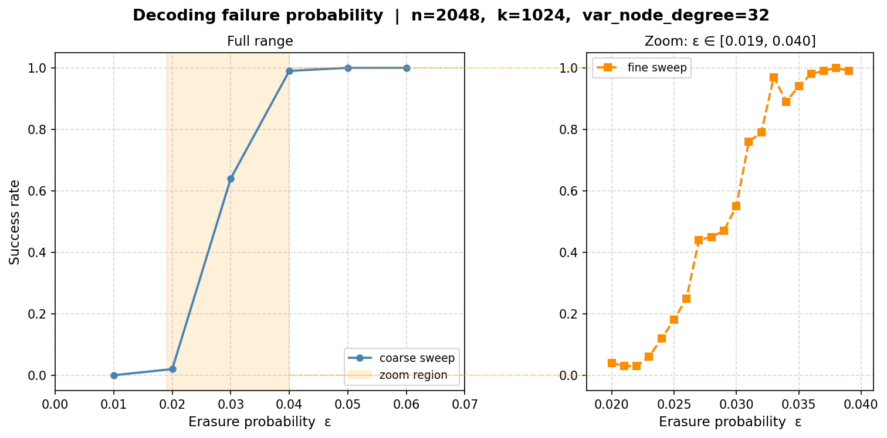
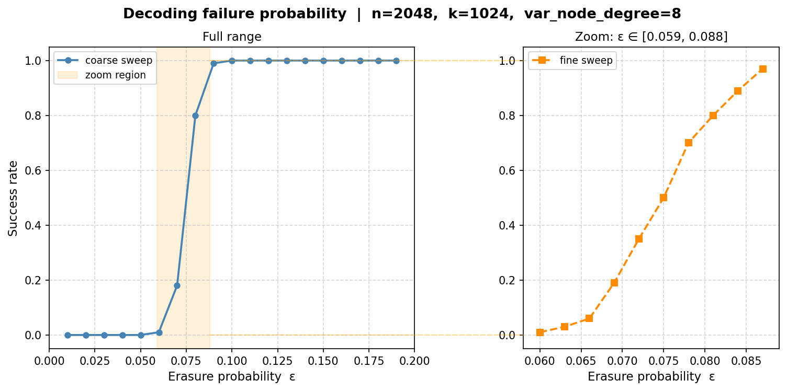

# Gallager ensemble

## Results



## Performance
The default configuration runs in:
```bash
________________________________________________________
Executed in  170.75 secs    fish           external
   usr time   54.47 mins    1.14 millis   54.47 mins
   sys time    0.15 mins    1.07 millis    0.15 mins
```

With Flambda turned on.

Without aggressive optimization flags the same code runs in:
```bash
________________________________________________________
Executed in  245.40 secs    fish           external
   usr time   64.04 mins    0.05 millis   64.04 mins
   sys time    0.21 mins    1.05 millis    0.21 mins
```

NOTE: the usr and sys times are counted per thread.

